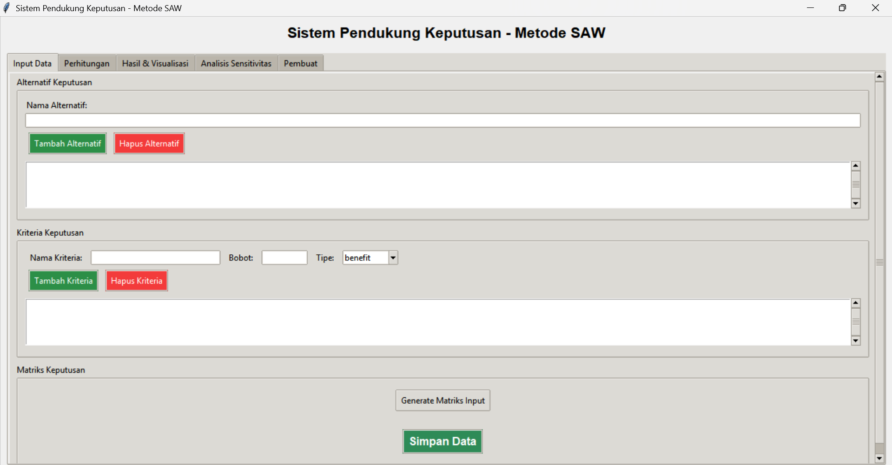

# 🧠 Sistem Pendukung Keputusan Metode SAW (Python GUI)

Aplikasi ini adalah **Sistem Pendukung Keputusan berbasis metode SAW (Simple Additive Weighting)** yang dibangun menggunakan **Python dan Tkinter GUI**, lengkap dengan fitur:

- Input Alternatif dan Kriteria (Benefit / Cost)
- Normalisasi dan Perhitungan Skor SAW
- Visualisasi Hasil (Bar dan Pie Chart)
- Analisis Sensitivitas Kriteria
- Export Hasil ke CSV

---

## ✅ Fitur Utama

- **Input Data**: Tambah/Hapus alternatif dan kriteria dengan bobot serta tipe (benefit/cost).
- **Matriks Keputusan**: Input nilai keputusan untuk setiap alternatif terhadap kriteria.
- **Perhitungan SAW**: Normalisasi matriks, pembobotan, dan perankingan otomatis.
- **Visualisasi**: Tampilkan hasil dalam bentuk **bar chart** dan **pie chart**.
- **Analisis Sensitivitas**: Uji pengaruh perubahan bobot terhadap peringkat.
- **Export**: Simpan hasil ke file `.csv`.

---

## 🚀 Cara Menjalankan

1. Pastikan Python 3.x sudah terinstall.
2. Install dependensi:
            ```bash
            pip install -r requirements.txt
3. Jalankan apliaski:
            main.py/python main.py


## 👤 Author
Raihan Alvian Nuryansyah

GitHub: https://github.com/differentlv


